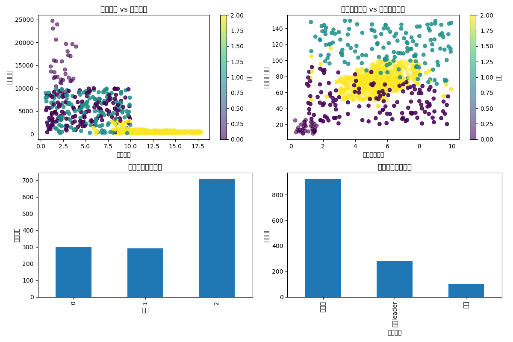

# 薅羊毛团体识别系统

本项目用于识别和分析薅羊毛团体，通过分析设备的网络特征和行为模式，识别出可能的团伙成员和团伙领导者。

## 项目结构

- `generate_data.py`: 生成模拟数据集，包含IMEI、IP地址、子网号、屏幕使用时间、交易频率、交易总额和应用跳转次数等信息
- `analyze_groups.py`: 主分析脚本，实现子网分析、K-means聚类和团伙识别功能
- `device_data.csv`: 生成的原始设备数据
- `suspicious_devices.csv`: 识别出的可疑设备数据
- `group_leaders.csv`: 识别出的团伙领导者信息
- `group_analysis.csv`: 团伙规模和交易特征分析结果
- `cluster_analysis.png`: 聚类分析可视化结果

## 分析流程

1. **数据生成**：生成包含设备特征的模拟数据集
2. **可疑设备识别**：
   - 识别同一子网下IMEI数量大于20的设备
   - 识别公网IP一致的设备
3. **K-means聚类分析**：
   - 使用屏幕使用时间、交易频率、交易总额、应用跳转次数等特征进行聚类
   - 将设备分为三类：重大leader、肉机和误差项
4. **团伙领导者识别**：
   - 根据IP变化频率和交易特征识别团伙领导者
   - 分析团伙规模和交易特征

## 使用方法

1. 运行数据生成脚本：
   ```
   python generate_data.py
   ```

2. 运行分析脚本：
   ```
   python analyze_groups.py
   ```

3. 查看分析结果：
   - `suspicious_devices.csv`: 可疑设备数据
   - `group_leaders.csv`: 团伙领导者信息
   - `group_analysis.csv`: 团伙规模和交易特征
   - `cluster_analysis.png`: 聚类分析可视化结果

## 分析结果说明

- **重大leader**：交易频率相对较低，但交易金额大，IP变化频繁
- **肉机**：交易频率固定，交易金额相对较低，屏幕使用时间长
- **误差项**：不符合上述两类特征的设备

通过分析每个团伙的规模和交易特征，可以评估团伙的活动规模和经济影响。

P1:交易频率 vs 交易金额
P2:屏幕使用时间 vs 应用跳转次数
P3:各聚类的设备数量
P4:各类型的设备数量


